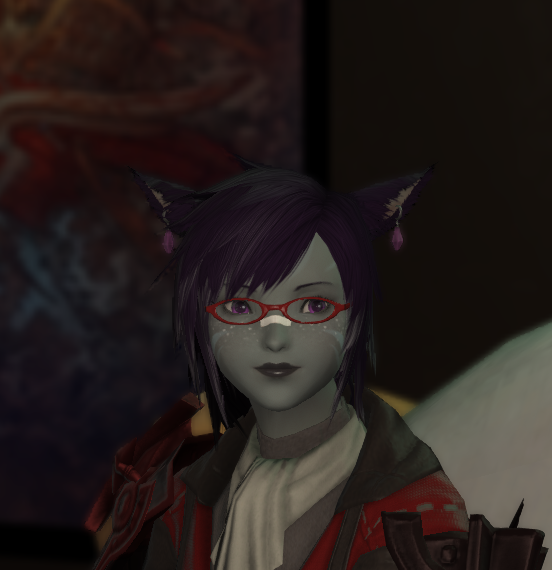
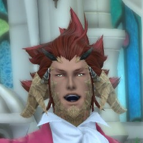

# Rank Information
Our ranks go as such:
* Dragon - The Leader of the Free Company, and highest-ranking officer
* Soldier - Second-rank members; These members have shown to be incredibly helpful in some way, be it crafting, gathering, or instructing new players.
* Sorcerer - Third-rank members; A group primarily made of some of the oldest and most trusted members of the Company
* Envoy - Currently the lowest rank; nothing special about these members, except that they make up the bulk of our Company!

## Leader
### Kelvius Argent - AKA Billy
* Kelvius is our leader, with the rank of Dragon. He commands the Envoys of Dissonance, and generally will lead us into battle, should we ever get into a battle.
* Billy is the absolute NUGGET of a person who helped bring us together, and tries his best to maintain this ragtag group of friends and idiots.

## Soldier
### Jinsoo Vas'Deanu - AKA Jayday
* Jinsoo is the resident CatDad magnet, and is one hell of a Dark Knight.
* Jayday, who tends to just go by Jay, is our mailman. Here's the mail, it never fails. It makes me want to wag my tail. When it comes I wanna wail, MAIL!!!!!!!!!!!!!!

### Laika Vas'Deanu - AKA Mayzyne
* Laika is our favorite Au'ra, and one of the few omni-crafters in the Company.
* Mayzyne, usually referred to as simply "Mayze," currently holds the position of being our chief of crafting, and has managed to make it pretty high up on the Firmament's leaderboards.

### Natsuki Aki - AKA ValkyrieFlame
* Natsuki is the former leader of the Envoys of Dissonance, back when the company was founded. As such, she is always considered our founding mother, and we thank her for helping to bring us together. When she stepped down as the leader of the company, we were all a bit shocked.
* ValkyrieFlame, better known to our group as Anna, or the Guild's Mum, is the former leader of this band of idiots. She did step down before a full year had passed of the founding of the company, and maintains the previous name, The Burning Embers, as her own group of misfits and friends. Though she no longer leads us, we treat her with the respect a founder deserves, and absolutely hound her with inappropriate jokes and the like.

## Sorcerer
### Mahosurn Aesotth - AKA Nexan

* Mahosurn, commonly referred to simply as "Maho," is a tomboyish Red Mage, Dark Knight, and Monk.
* Nexan, frequently referred to simply as "Nex," is the maintainer of this site, and an overall huge nerd about technical things in the real world.

### Zaldanas Zanovas - AKA Zando

* The resident White Mage of the Free Company, Zaldanas is one of the few Male Au'Ra inhabiting our Free Company.
* Zando, which is short for Zandodak, is a huuuuge nugget that happens to share a braincell with Nex, and it causes all sorts of chaos.

### Logan Blueflame - AKA KaptainKaz
* Logan, despite being a newer member of the company, is an old friend of Kelvius, and will seemingly follow him to the ends of the world.
* Kaz is Billy's childhood friend (no, we're not making this up!) and got dragged into the game some time in 2021.